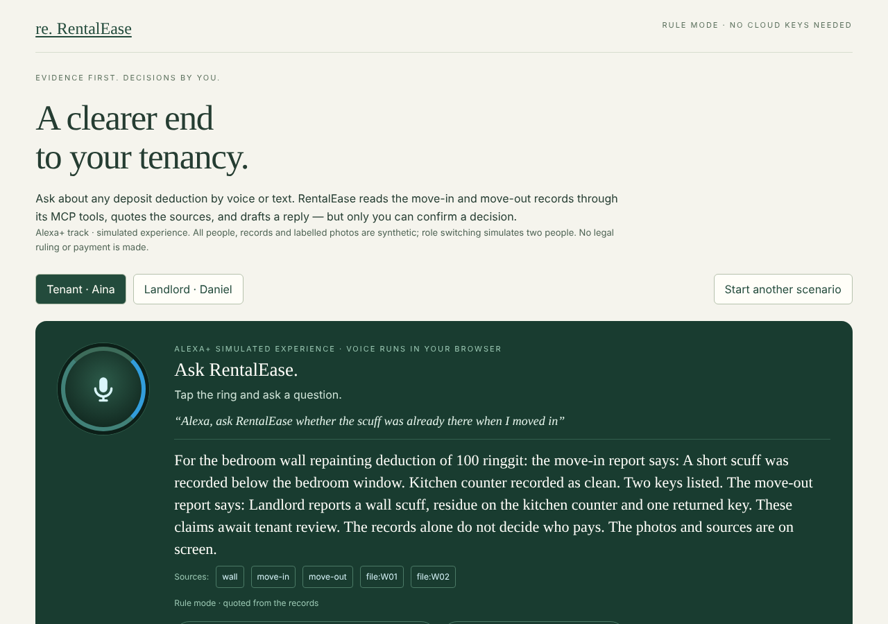

# RentalEase Move-Out Companion

**Ask about a deposit deduction out loud, hear what the move-in and move-out records actually say, and let the assistant draft your reply — but only you can confirm a decision.**

An evidence-based voice assistant for tenants and landlords settling a rental deposit, built for the **Alexa+ track** of the Amazon Developer Hackathon as a simulated experience. Answers come from Amazon Bedrock (optional) or deterministic rules, always through the project's own MCP server.



## Start here: three commands, no cloud keys

Use Node.js 22 (on Windows, a short checkout path such as `C:/dev/rentalease-companion`).

```sh
npm ci
npm run dev:companion
```

Open **http://127.0.0.1:3030** (it redirects to the guide) or go straight to **http://127.0.0.1:3030/demo**. Keep the exact `127.0.0.1:3030` address: this local demo checks its host and origin.

Then try:

1. **Voice.** In Chrome or Edge, tap the light ring and ask *"Was the scuff already there when I moved in?"* (an optional *"Alexa, ask RentalEase…"* prefix works too). Without a microphone, tap a suggestion chip. The answer quotes both reports, shows source chips and is read aloud.
2. **A drafted decision.** Say or tap *"Dispute the wall charge for me"*. The draft appears as a **Check before saving** preview, or as a pre-filled form in rule mode. Press **Confirm and save** yourself.
3. **Both sides.** Switch to **Landlord · Daniel** to reply, propose a new amount or withdraw. Resolve all three deductions; the intended outcome is a MYR 1,755 recorded refund. No money is transferred.
4. **MCP.** Open **Connect an MCP client to this case** at the bottom of the page and run the MCP Inspector command it shows.

Everything runs without Supabase, AWS or model credentials. It uses synthetic people, records and four visibly labelled AI-generated photos, with standard, missing-baseline and conflicting-account scenarios. New scenarios keep old local histories.

## Optional: Amazon Bedrock answers

Set `COMPANION_BEDROCK_MODEL` (for example `apac.amazon.nova-pro-v1:0` in Malaysia/Singapore) plus AWS credentials or a Bedrock API key in `.env.local`, then restart. An Amazon Nova model then:

- reads the case through the RentalEase MCP tools;
- answers in short spoken sentences with checked citations;
- turns "dispute this" requests into a draft preview.

It never decides liability or saves anything. An amount in a draft (for example a landlord's revised offer) changes nothing until a person confirms it, and a revised amount still needs the tenant's acceptance. Any Bedrock failure falls back visibly to the rule assistant. See [voice assistant and Bedrock setup](docs/VOICE-ASSISTANT.md).

The Bedrock path is tested end to end with the real AWS SDK against a local mock Converse server (`scripts/mock-bedrock.mjs`). A live AWS call was not made in the development environment.

## MCP server

`npm run dev:companion` also serves a Model Context Protocol endpoint at `http://127.0.0.1:3030/api/mcp`:

- protocol `2025-11-25`, Streamable HTTP, official TypeScript SDK;
- per-case bearer tokens shown on the demo page;
- six read-only tools: tenancy list, settlement context, deduction evidence, agreement, questions, and draft checking.

There is no confirm or payment tool. Recipes for MCP Inspector, Claude Code and Claude Desktop are in [MCP.md](docs/MCP.md).

## Verification

On 2026-10-08, in a Linux container:

- `npm test`: 244/244 regressions pass.
- TypeScript, lint and the production build pass.
- `npm run test:demo:http` passes against the running demo in rule mode and in Bedrock-mock mode.
- The official MCP Inspector CLI listed and called the tools against the live endpoint.
- A headless-browser walkthrough with mocked speech APIs passed in both modes.

**Not verified:** a live Amazon Bedrock call, real microphone hardware, Safari/Firefox, and a macOS clean clone.

The earlier submission candidate's browser, responsive and clean-install acceptance is recorded in [acceptance scope](docs/FINAL-ACCEPTANCE.md) and [GitHub delivery verification](docs/GITHUB-DELIVERY.md). That page also explains the cross-platform lockfile fix.

The original single-item `/companion` workspace and the private `/records` workspace remain separate. See the [independent demo guide](docs/INDEPENDENT-DEMO.md) for the full walkthrough and storage boundaries. [Model evaluation](docs/LOCAL-MODEL.md), [database setup/security limitations](docs/SUPABASE-DEVELOPMENT.md) and [private evidence boundaries](docs/PRIVATE-EVIDENCE.md) cover the records workspace.

## Try authenticated Supabase records

On the configured development machine, run `npm run dev:records` and open `http://127.0.0.1:3031/records`. Test account credentials are stored only in the ignored `.local-runtime/records-test-accounts.json`; backend secrets are in `.env.records.local`. Sign in, open the authorized tenancy, and ask "What refund and deductions are recorded?" Each question rechecks access and reads current records. No paid model calls, payments or registrations occur. The setup is local-only; do not deploy these development credentials publicly. Run `npm run test:records:http` against the running server for read-path integration checks.

The **Find a way forward** section supports text reports, tenant disputes, landlord replies and withdrawals, revised-amount proposals, and tenant acceptance or rejection. Every write requires a preview and explicit confirmation. Proposing a new amount does not apply it: the tenant must accept it first. Each deduction resolves independently; unresolved items keep the settlement open. An agreed settlement is not a payment. Refreshing drops unconfirmed previews, not saved history, and restores account-scoped conversation and selection for the browser session.

Conversation matching is intentionally conservative. Multiple-item decisions, hypothetical/quoted requests and ambiguous amounts ask for clarification instead of silently selecting an action. An explicit rejection of a reply is distinct from rejection of a pending price proposal. New messages clear unsaved form drafts. Selected-item Q&A retains access, read-only and liability guards; missing/disputed sources are surfaced without resolving factual contradictions.

The **Review at a glance** summary shows each item's contribution and next step, separates pending proposals, and warns about inconsistent amounts. **Download current summary** rechecks access and exports a fresh, dated text snapshot with decisions and source references, never private file contents. The download makes no database changes. Keep exported source text private.

Open `/guide` for the English demonstration guide. It clearly distinguishes the Alexa+ simulation from formal runtime integration and the retained closed database case from the repeatable local walkthrough.

The records conversation calls its own local **MCP Streamable HTTP** endpoint (`http://127.0.0.1:3031/api/mcp`, protocol `2025-11-25`) with the official SDK, authenticated by the records login session. The six tools are the same ones the independent demo serves on port 3030. Saving remains a separate human confirmation in the records page; MCP exposes no confirmation or payment tool. See [MCP setup, tests and deployment boundaries](docs/MCP.md). Run `npm run test:mcp` for credential-free protocol and safety checks. AWS hosting and formal Alexa+ account linking are not implemented.

Both local MCP endpoints have per-account rate limits, concurrent-request caps and bounded body reads. The records web client times out after 20 seconds without automatically retrying an action. These limits protect a single-process local workspace; they are not distributed production controls or an AWS spending cap. See the [remote integration acceptance plan](docs/MCP-REMOTE-PLAN.md) before changing the loopback-only policy.

Fixture A retains the earlier reply-acceptance test. Fixture B contains three synthetic deductions for a retained multi-item walkthrough; do not reset either fixture to repeat a demo. `npm run test:records:resolution` checks the full state machine in a rolled-back database transaction. The private evidence reader supports confirmed PNG/JPEG/PDF uploads, authorized original downloads, paired image previews and deduction-specific file references. Four visibly labelled AI-generated photographs are under `demo-assets/evidence/` (outside the public folder). See [setup and limits](docs/PRIVATE-EVIDENCE.md).

For the earlier optional local-AI experiment in the records workspace, start the installed model with `npm run model:serve`, then start the records server with `npm run dev:records -- --local-model`. Ask "Was the scuff already there when I first arrived?" The model selects authorized source IDs; the server displays exact source text and keeps both move-in and move-out context. Invalid or unavailable AI falls back visibly. Amounts and actions remain rule-based. Verify with `node scripts/test-records-http.mjs --local-model`.

## Try the zero-spend prototype

After installing dependencies with `npm ci`, run:

```sh
npm run dev:companion
```

Open **http://127.0.0.1:3030/companion**. No `.env`, database, AWS credentials, or cloud services are needed for rule mode. The command binds to loopback, enables only the local companion service, blocks inherited APIs/dashboard routes, skips admin bootstrap and avoids the login provider. Normal `npm run dev` retains the inherited application's authentication behavior.

Choose **Compare evidence**, then **Prepare a dispute → Confirm dispute**. Switch to **Landlord**, choose **Review withdrawal → Confirm withdrawal**, and see the proposed refund update. Use **Reset / change demo scenario** to try disputed or missing move-in records. Refresh restores progress but requires a new confirmation for any unsubmitted draft.

See the [walkthrough](docs/DEMO.md) and [local service, model setup and limitations](docs/LOCAL-SERVER.md). Sessions are stored in the ignored `.companion-data/` directory. Use one server process; stale tabs must refresh before writing. Previous browser-only records are not imported.

## What we are building

A tenant asks: "My landlord proposed a RM100 wall-repainting deduction, but the mark was there when I moved in. Help me find the record and respond."

The assistant retrieves the relevant report, photos and agreement clause through its MCP tools, presents the sources, drafts a response and records a decision only after the correct person confirms it. The landlord can review the same evidence and reply, propose a new amount or withdraw. Both parties can return later to see progress. A real Alexa+ integration would reuse the same MCP server; that runtime is not connected here (see [Alexa+ access](docs/ALEXA-ACCESS.md)).

The assistant organizes evidence and coordinates the existing workflow. It does not decide legal liability, sign agreements, or transfer money.

## Existing baseline

- Landlord, tenant, and administrator accounts.
- Properties, rooms, tenancies, and agreement negotiation/signing.
- Gemini-assisted agreement generation, explanation, translation, and edits.
- Move-in/move-out condition reports, photo comparison, and counter-evidence.
- Deposit deductions, tenant responses, landlord withdrawal, and settlement status.
- Notifications, payment-proof uploads, and contract-hash anchoring code for Sepolia.

These are inherited features, not hackathon additions. Importing their source does not verify the original deployment or external services.

## Local setup

Use Node.js 22 LTS and npm. Provision a separate PostgreSQL database and development service credentials.

1. Copy `.env.example` to `.env` and fill the variables for the features you will test. Never reuse the original application's database. The inherited login flow uses Upstash; the separate companion and records modes above do not use that flow.
2. Install the locked dependencies:

   ```sh
   npm ci
   ```

3. Validate the schema and explicitly apply migrations to the development database:

   ```sh
   npm run db:validate
   npm run db:deploy
   ```

4. Start the application:

   ```sh
   npm run dev
   ```

The inherited development URL is `http://localhost:3000`. No account passwords are committed in this repository. The separate Supabase development setup contains synthetic test accounts. Do not use real identity documents or tenant records when building the demo.

## Checks and builds

```sh
npm run db:generate
npm test
npm run typecheck
npm run lint
npm run build
```

`build` generates the Prisma client and compiles the app; it no longer applies database migrations. Database changes are an explicit `db:deploy` step. External-service integration and full application startup need configured development services.

## Hackathon development

- [Original baseline and new-work boundaries](docs/BASELINE.md)
- [Judge guide and repeatable walkthrough](docs/JUDGE-GUIDE.md)
- [Voice assistant and Amazon Bedrock setup](docs/VOICE-ASSISTANT.md)
- [MCP endpoints and client recipes](docs/MCP.md)
- [Devpost draft for owner review](docs/DEVPOST-DRAFT.md)
- [English recording script](docs/DEMO-SCRIPT.md)
- [Final acceptance and limitations](docs/FINAL-ACCEPTANCE.md)
- [GitHub candidate and clone verification](docs/GITHUB-DELIVERY.md)
- [MVP and development backlog](docs/ROADMAP.md)
- [Architecture decisions](docs/ARCHITECTURE.md)
- [Developer feedback log](docs/FRICTION_LOG.md)
- [Alexa+ permission findings and submission boundary](docs/ALEXA-ACCESS.md)
- [Remote MCP verification core and remaining OAuth gates](docs/MCP-REMOTE-PLAN.md)
- [Verification performed during setup](docs/VERIFICATION.md)

Target: the Alexa+ simulated-experience path in the [Amazon Developer Hackathon](https://amazonappdev2026.devpost.com/rules). This is an independent project, not an official Amazon product or a certified Alexa integration. The Amazon Bedrock integration is real code using the AWS SDK; check the AWS Builder bonus rules and run it with your own AWS account before claiming live results.

## Repository and licensing

This repository is public and released under the [MIT License](LICENSE). Third-party dependencies retain their respective licenses. Never commit service keys, AWS or Bedrock credentials, wallet private keys, `.env` files, uploaded identity documents, or production data.
